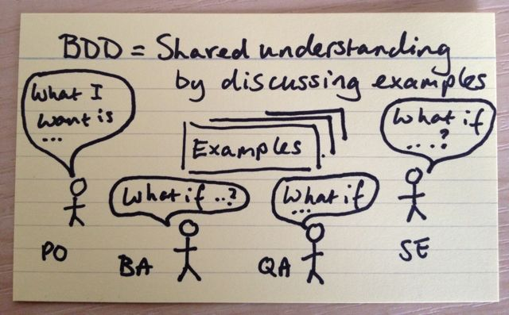

## TL;DR

> BDD is an approach for building a shared understanding on what software to build by working through examples.

I've managed to convince my boss its a good idea using BDD and have been given the go ahead to look into its feasibility.  BDD can be presented in the form of automated tests using [cucumber.io](https://docs.cucumber.io/). I need to look into how to integrate BDD & automated testing into the development or release pipeline, to prove that any new code doesn't break already existing functionality.

## The Problem

I started a project at work about a year ago, and we're getting to the point where we need to release for the first time.  Crunch Time.  As we started talking about release dates, it got me thinking:

- How we are going to prove that our product does what its supposed to.  
- How do I know that I haven't already broken something that was working?  
- How can I reliably make sure that I don't break something the next time I write some code?  

Testing is done manually.  This means that as the product grows, so will the time it takes to regression test.

## The Solution

### How we are going to prove that our product does what its supposed to

We need to determine and clearly present what our product can do.  We need to provide a link between the requirements of the product, and verifying the requirements are possible.  *Behaviour Driven Development* can help.

### How do I know that I haven't already broken something that was working

Automate Tests.  Easier said that done, but moving from manual testing to automated testing will give us the ability to regression test more often without consuming a tester's time.

### How can I reliably make sure that I don't break something the next time I write some code

Allow the Automated tests to be run by developers, as they are writing new code.  Getting developers closer to the testing process will highlight any potential breaking changes earlier and allow the developer to fix these issues without anyone knowing they happened.

## Behaviour Driven Development (BDD)

I found [this website](http://agilecoach.typepad.com/agile-coaching/2012/03/bdd-in-a-nutshell.html) that describes Behaviour Driven Development better than I would.  It says:

> BDD is an approach for building a shared understanding on what software to build by working through examples.

> BDD is pretty simple, describe what you want the system to do by talking through example behaviour.Work from the outside-in to implement those behaviours using the examples to validate you're what you're building.

This approach will help clarify what our product is supposed to do, through examples.  I'm the sort of person who prefers talking in examples.  I feel it shows my understanding of the requirements.  The challenge will be validating the examples are possible within our product.

Validating examples can be done manually, or through automated testing.

### Cucumber & Gherkins

[Cucumber](https://docs.cucumber.io) is a concept of writing Gherkins which are human readable examples and verifying them.  Step Definitions can be written in a variety of languages that relate to each line within a Gherkin, allowing you to run the Gherkin as an automated test in a language of your choice.

## Implementing BDD and Automated Testing in our project

To implement this change in mentality within our project, everyone will need a clear understanding of what BDD is and what it hopes to achieve.  If they can see the value that it can add, then it will help them buy into the concept.  

### The Business Analyst

The Business Analyst (BA) is responsible for gathering requirements and feeding them into the Backlog in the form of Backlog Items.

The BA will need to be willing to contribute to any discussions that result in examples being produced, and be willing to verify that the examples meet the requirements and are not out of scope.  

### The Developer

The developer is responsible for implementing the requirements within the Backlog Item.

The developers will need to contribute to creating examples and possibly help implement automated tests.

### The Tester

The tester is responsible for proving the requirements within the Backlog Item have been met and marking it as complete.

The testers will need to contribute to creating examples and possibly help implement automated tests.  Their speciality in testing makes them crucial in creating edge case and erroneous examples.

### Who creates the examples and when

[cucumber.io](https://docs.cucumber.io/guides/overview/) calls documents with written examples a *Gherkin*. They state:

>It’s usually best to let developers write Gherkin if the team is practicing BDD (test first).
>
>If Cucumber is used solely as a test automation tool (test after) it can be done by testers or developers.
>
>It is usually counterproductive to let product owners and business analysts write Gherkin. Instead, we recommend they participate in Example Mapping sessions and approve the Gherkin documents after a developer or tester has translated it to Gherkin.

My suggestion is that testers write up the examples at the beginning of the sprint, when there is not much testing to do, and a developer or tester can write the Step Definitions to verify the examples.

## Lets chat with the boss

So I talked to my boss about BDD and Cucumber.  Overall it was largely successful as he could see this was a good way to introduce automated testing and liked the idea of living documentation. He had some questions:

- How can we integrate this into our existing build & release pipeline?
- Can he see some examples

I'm going to try and answer these question over the next few blog posts I make.